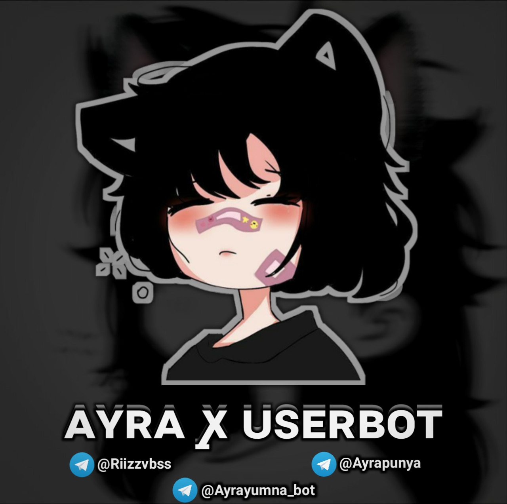

 <h1 align="center">✨ ᴀʏʀᴀ ꭙ ᴜꜱᴇʀʙᴏᴛ ✨</h1>

<a href="https://github.com/riizzvbss/Ayra-Userbot2/commits"> </a>
[](https://github.com/riizzvbss/Ayra-Userbot2)
[](https://GitHub.com/riizzvbss/Ayra-Userbot2/graphs/commit-activity)
[](https://app.codacy.com/gh/riizzvbss/Ayra-Userbot2/dashboard)
[](https://github.com/riizzvbss/Ayra-Userbot2/fork)
[](https://github.com/riizzvbss/Ayra-Userbot2/stargazers)


<p align="center">
  
</p>

👩‍💻 ᴀʏʀᴀ ꭙ ᴜꜱᴇʀʙᴏᴛ adalah userbot Telegram modular yang berjalan di Python3 dengan database sqlalchemy.

Berbasis [Paperplane](https://github.com/RaphielGang/Telegram-UserBot) dan [ProjectBish](https://github.com/adekmaulana/ProjectBish) userbot.
Saya membuat repository ini untuk memilih dan menambahkan beberapa modul yang saya butuhkan dengan banyak perubahan, fitur dan modul.

## Disclaimer

```
Saya tidak bertanggung jawab atas penyalahgunaan bot ini.
Bot ini dimaksudkan untuk bersenang-senang sekaligus membantu anda
mengelola grup secara efisien dan mengotomatiskan beberapa hal yang membosankan.
Gunakan bot ini dengan risiko Anda sendiri, dan gunakan userbot ini dengan bijak.
```

## ========×========

<details>
<summary><b>🔗 Deploy di VPS</b></summary>
<br>

### Tutorial Deploy di VPS


 • `git clone https://github.com/riizzvbss/Ayra-Userbot2`

 • `cd Ayra-Userbot2`

 • `pip3 install --no-cache-dir -r requirements.txt`
 
 • `pip3 install --no-cache-dir -r resources/startup/optional-requirements.txt`

 • `cp .env.sample .env `

 • `nano .env `
  - isi vars
  - Jika sudah 
  - ketik ctrl + S
  - ctrl + X

 • `screen -S Ayra-Userbot2`

 • `bash startup`
 
 • `CTRL A & CTRL D`

</details>

<details>
<summary><b>🔗 Deploy To Heroku</b></summary>
<br>

<p><a href="https://heroku.com/deploy?template=https://github.com/riizzvbss/Ayra-Userbot2"></a></p>


</details>

<details>
<summary><b>🔗 Redis & Mongo </b></summary>
<br>

### Tutorial Redis & Mongo

- For **Redis** (tutorial [here](./resources/extras/redistut.md))
  - `REDIS_URI` - Redis endpoint URL, from [redislabs](http://redislabs.com/).
  - `REDIS_PASSWORD` - Redis endpoint Password, from [redislabs](http://redislabs.com/).
- For **MONGODB**
  - `MONGO_URI` - Get it from [mongodb](https://mongodb.com/atlas).
- For **SQLDB**
  - `DATABASE_URL`- Get it from [elephantsql](https://elephantsql.com).
  
  </details>

## Updates & Support

Follow Channel [Ayra Quote](https://t.me/ayrapunya) untuk info Update bot dan Gabung Group [Ayra Support](https://t.me/gdrnch) untuk untuk diskusi, pelaporan bug, dan bantuan tentang Ayra-Userbot.

# Credits
* [](https://t.me/UltroidDevs)
* [](https://t.me/riizzvbss)
* [Lonami](https://github.com/LonamiWebs/) for [Telethon.](https://github.com/LonamiWebs/Telethon)
* [MarshalX](https://github.com/MarshalX) for [PyTgCalls.](https://github.com/MarshalX/tgcalls)

> Kang with 💕 by [Riizz](https://t.me/riizzvbss).    

# License
[](LICENSE)   
Ayra is licensed under [GNU Affero General Public License](https://www.gnu.org/licenses/agpl-3.0.en.html) v3 or later.


